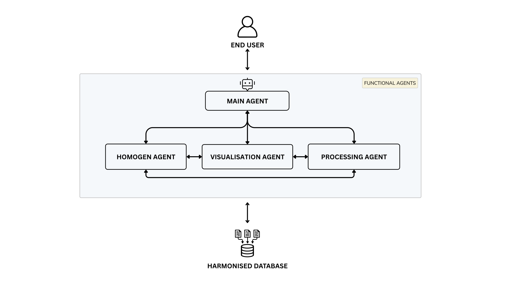

# AI4AIR – AI Agent System for Air Quality Forecasting


Welcome to **AI4AIR**, an intelligent AI agent-based system designed to collect, process, and visualize air quality data for specific regions. This project combines real-time environmental data with machine learning models to forecast future air quality and empower citizens and policymakers with actionable insights.

## Project Overview



**AI4AIR** is composed of four autonomous agents working in harmony:

| Agent        | Role                                                                 |
|--------------|----------------------------------------------------------------------|
| Main-Agent / NEXUS| Coordinates all other agents, manages task scheduling, and facilitates communication between agents. |
| Homogen-Agent / HOMOGEN      | Ingests, cleans, aligns, and harmonizes air quality and weather data from various sources. |
| Processing-Agent / AIRCAST    | Applies machine learning models to predict future air quality metrics (e.g., PM2.5, AQI). |
 Visualization-Agent / DASH    | Visualizes current and predicted data via interactive dashboards.     |

## Key Objectives

- Harmonize air quality data from heterogeneous sources 
- Predict future pollutant levels (PM2.5, NO₂, AQI) using machine learning
- Provide accessible and interactive visual dashboards for public and institutional use
- Support modular agent-based development for future scalability

## Tech Stack (yet to be finalised)

- Language: Python 3.10+
- Machine Learning Frameworks: scikit-learn, XGBoost, LSTM (Keras/TensorFlow)
- Visualization: Streamlit, Dash, Plotly
- Data Ingestion: Requests, Pandas, APIs (UBA, OpenAQ, DWD)
- Storage: PostgreSQL

## Project Structure

```
AI4AIR/
│
├── NEXUS/       
│   └── orchestrator_agent.py
├── HOMOGEN/           
│   └── homogen_agent.py
├── AIRCAST/         
│   └── processor_agent.py
├── DASH/           
│   └── app.py
├── data/              
├── models/            
├── requirements.txt   
├── README.md          
└── .env               
```

## Example Workflow

0. NEXUS initializes the pipeline, schedules agent tasks, and manages communication between HOMOGEN, PROCESSOR, and VISIOS.
1. HOMOGEN connects to APIs (e.g., UBA, OpenWeather), fetches recent air quality and weather data, and stores harmonized output in a structured format.
2. AIRCAST loads this harmonized data, applies trained machine learning models, and forecasts future pollutant levels and AQI.
3. DASH reads both current and predicted data, and displays it via a modern dashboard for user interaction.

## Sample Use Case

- City: Berlin  
- Goal: Predict PM2.5 levels for the next 24 hours  
- Outcome: Real-time dashboard shows air quality trends, alerts high-risk periods, and helps citizens plan activities.

## Future Extensions

- Add more agents (e.g., DETEKTA, EXPLAINA)
- Integrate satellite data calibration (Sentinel-5P via CALIBRO)
- Implement feedback loops from users (FEEDBACKO)
- Real-time alert system via SMS/Email (REACTOR)
- Enhance ORCHESTRATOR with intelligent scheduling and adaptive coordination

## License

This project is licensed under the MIT License. See the `LICENSE` file for details.

## Contributing

Contributions, bug reports, and feature suggestions are welcome.  
Please open an issue or submit a pull request.

## Contact

For questions, feedback, or collaboration requests:

- GitHub: [Poojashrees3](https://github.com/Poojashrees3), [PrajwalUnaik](https://github.com/PrajwalUnaik), [Ash-git-create](https://github.com/Ash-git-create)

